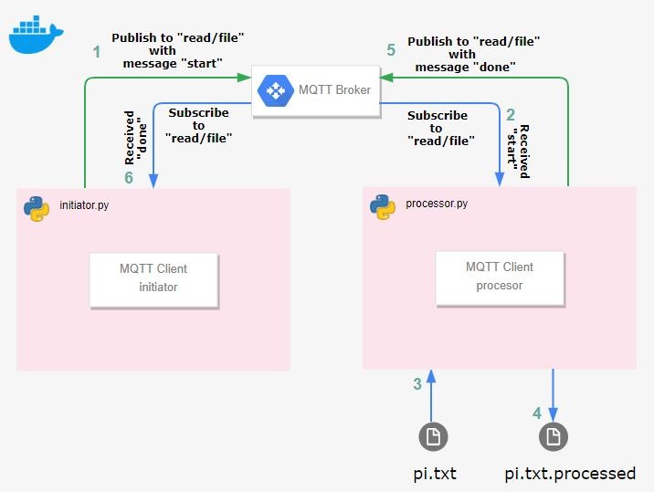

# mqtt-read-write
  [](https://sonarcloud.io/dashboard?id=bigillu_mqtt-read-write)

Python solution to demonstrate the following,

- File io read/write
- MQTT publisher/subscriber model



## Installation

*Prerequisites*

- Python 3.6+
- A message broker, for example [mosquitto](https://mosquitto.org/)

After checking out the repository, perform the following on a terminal

```bash
cd mqtt-read-write
# setup venv
python3 -m venv py && source py/bin/activate
# install the necessary packages
pip3 install -r requirements.txt
```

## Run

Once the broker is running run the following scripts manually,

   - Subscriber [(processor.py)](./src/processor.py)

      - ```bash
         # For usage
         python3 src/processor.py -h
         # Example
         python3 src/processor.py -f data/pi.txt
         ```

   - Publisher [(initiator.py)](./src/initiator.py)
      - ```bash
         # For usage
         python3 src/initiator.py -h
         # Example
         python3 src/initiator.py
         ```

## Run it the docker way
In order to make things easy for the reader, I have packaged the application as a docker image.

*Prerequisites*
- [Docker](https://www.docker.com/)

Open a terminal and run, 
```bash
# Pulls the application image from docker hub and spins a docker container
# Note: Mosquitto broker will be running automatically on localhost, port 1883
docker pull abigillu/mqtt-read-write:latest && docker run --rm -it abigillu/mqtt-read-write:latest
```

In order to run the initiator and processor python scripts, we need to enter into the docker container, 

```bash
# List the docker containers running to determine the <container id>
docker container ls 
```

- Running the [(processor.py)](./src/processor.py) inside the container
   - ```bash
      # Enter into the docker container
      docker exec -it <container id> bash
      # Run the script
      cd app && python3 src/processor.py -f data/pi.txt
      ```
- Running the [(initiator.py)](./src/initiator.py) inside the container
   - ```bash
      # Enter into the docker container
      docker exec -it <container id> bash
      # Run the script
      cd app && python3 src/initiator.py
      ```

- Result
    - The communication logs will appear on the respective terminals,
    - The processed file(*pi.txt.processed*) can be found in the *app/data* directory
      - ```bash
         cd /app/data/ && ls -l
        ```
*NOTE*: The solution was tested with a max file size of 1GB. Since github has a restriction of file size limit to 100MB, I have uploaded a smaller sized file.
The viewer can test the solution with a large text file.
## Author

* Abhimanyu Selvan is the author of this application
  * Follow me on [twitter.](http://www.twitter.com/diabhey)
